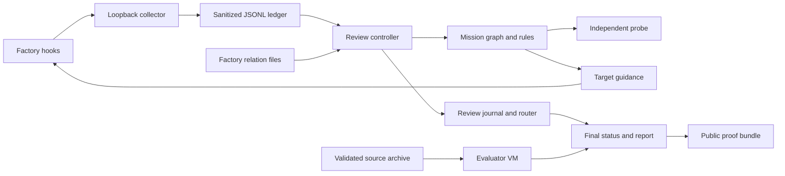

# Architecture

Shadow Mission wraps one Factory Mission with a host-controlled review pipeline.
It separates collection, review, guidance, final evaluation, and public proof.

## System flow

## Plugin boundary

`.factory-plugin/plugin.json` defines the `shadow-mission` plugin.
`hooks/hooks.json` registers six Factory lifecycle events.
`hooks/shadow_hook.py` starts the dependency-free hook runtime.

The hook emits nothing when Shadow activation is absent.
During an approved run, it sends one bounded event to a loopback collector.
The hook uses the installed plugin root for every script path.

## Collection and storage

`src/shadow_mission/collector.py` authenticates the raw event envelope before sanitization.
It allowlists fields and redacts known sensitive values.
The private ledger can retain Factory identifiers and absolute tool paths from allowed fields.

`src/shadow_mission/storage.py` owns one bounded writer for each run.
`events.jsonl` is the authoritative event and response ledger.
`index.sqlite3` is a rebuildable index.

An authenticated retry must use the first event's canonical digest.
The retry receives the first durable response.
It cannot consume guidance twice.

## Identity and role mapping

Transport authentication proves possession of the run secret.
It does not prove Factory authority.
The observed Mission also receives that secret.

`src/shadow_mission/correlation.py` reads pinned Factory Mission relation files.
That file contract is not a documented Factory API.
Shadow binds it to the approved Droid binary and source digest.

The role mapper uses Mission state, feature state, and worker progress together.
Prompt markers and self-reported roles never establish authority.
Ambiguous or changed assignments enter quarantine.

## Review pipeline

`src/shadow_mission/transcript.py` converts bounded Factory transcript records into sanitized observations.
`src/shadow_mission/extractor.py` turns selected observations into structured claims.
Each extractor session uses a clean temporary home and no enabled tools.

`src/shadow_mission/graph.py` projects claims, evidence, files, tests, and sessions.
`src/shadow_mission/rules.py` applies these deterministic rules:

1. cross-worker conflict;
2. shared-assumption failure;
3. validator-evidence gap.

A model response cannot create a rule match by itself.

## Probe and guidance

`src/shadow_mission/probe.py` receives one bounded, redacted snapshot.
It can receive only evidence-named repository files.
It has no tools and cannot edit source.

Fallback hook evidence has `UNKNOWN` authority.
A probe cannot confirm a blocker from that evidence alone.
The preview therefore supports notes and concerns on this path.

`src/shadow_mission/router.py` stores one intervention for each finding and target session.
The selector sends one intervention during one eligible session update.
`PostToolUse.additionalContext` carries model-visible guidance.

## Intervention lifecycle

The router records `queued`, `delivered`, `acknowledged`, `corrected`, and `resolved` states.
A correction needs source proof and passing-test proof.
The proof can come from sessions in the same Mission and finding.
Each evidence record still binds to the exact intervention.

A finding closes only when every intervention in its group reaches `resolved`.
The released proof bundles record `resolved` interventions in pairs 47, 49, and 55.
No seeded finding group fully resolved in the recorded series.

## Finalization and evaluation

`src/shadow_mission/runtime.py` stops hook intake before final state capture.
It drains review work and reconciles late correction evidence.
It writes final status from the durable router state.

The host Factory Mission runs as a same-user process.
Shadow proves that process group stopped before source export.
It does not claim Mission VM isolation.

`src/shadow_mission/evaluation.py` validates the final-source archive.
It then starts a fresh Lima evaluator VM.
The trusted evaluator parent owns assertions and verdict assembly.
Mission functions run in bounded child processes.
The evaluator VM must be deleted before success persists.

## Reports and proof bundles

`src/shadow_mission/reporting.py` rebuilds reports from authoritative records.
Cached Markdown has no authority.
`demo/compare.py` requires a fully resolved seeded finding group for a causal claim.
The current records fail that requirement by design.

`demo/proof_bundle.py` creates sanitized, digest-bound public archives.
Its verifier checks member digests, source archives, reports, comparisons, and excluded data.
Verification uses no Factory or model call.

See [Reproducibility](reproducibility.md) for the released bundle checks.
